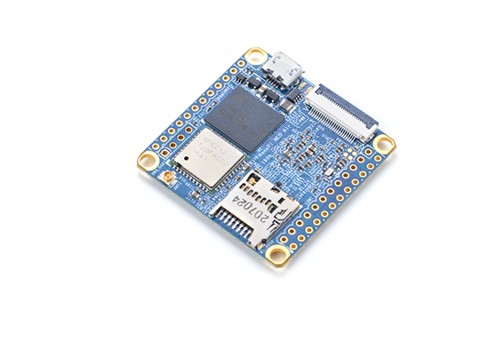
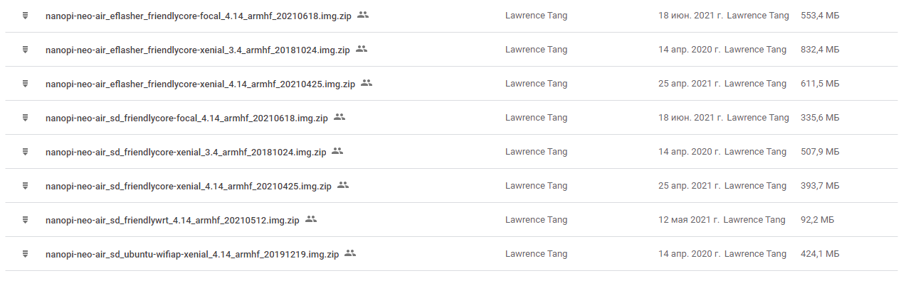
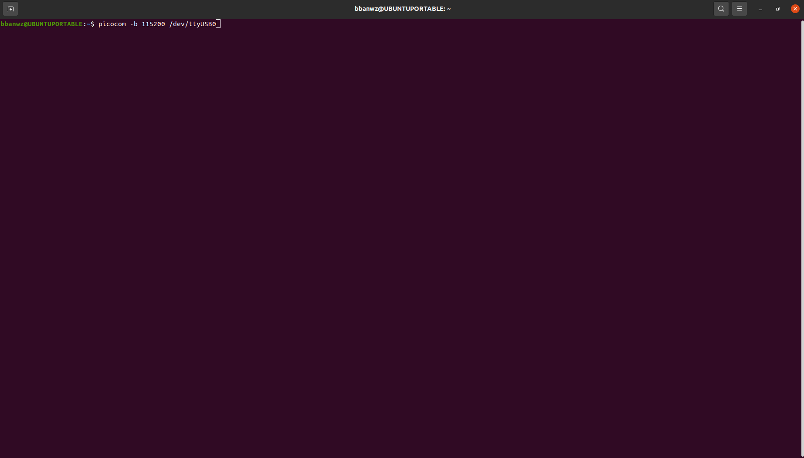

Использование платы NanoPi
==========================

.. _installation:

Знакомство с платой
-------------------

Микрокомпьютер NanoPi представляет собой встраиваемый одноплатный микрокомпьютер с размещенными на одной плате вычислительным процессором, оперативной памятью, блоком энергонезависимой памяти, а также набором беспроводных интерфейсов, таких как: Bluetooth и Wi-Fi. Внешний вид микрокомпьютера представлен на рисунке 1.1: 

       Рисунок 1.1 – Внешний вид микрокомпьютера NanoPi

Микрокомпьютер NanoPi от AppliedRobotics имеет следующие характеристики описанные в таблице 1.1: 

.. table:: Таблица 1.1 – технические характеристики микрокомпьютера NanoPi:

    +------------------------+----------------------------------------+
    | Система на кристалле   | Allwinner H3 (CPU + GPU)               |
    +------------------------+----------------------------------------+
    | Процессор              | 4 ядера (Quad-core) ARM Cortex-A7      |
    |                        | 1.2 ГГц, 32KiB Instruction + 32KiB     |
    |                        | Data L1 cache на ядро и 512KB L2 cache |
    +------------------------+----------------------------------------+
    | Графический процессор  | Mali-400MP2 600 МГц                    | 
    |                        | поддерживает OpenGL ES 2.0             |
    |                        | OpenCL 1x, DX9_3, OpenVG,              |
    |                        | 1080p45 H.264                          |
    +------------------------+----------------------------------------+
    | ОЗУ                    | DDR3 256/512 Мб (совместно с GPU)      |
    +------------------------+----------------------------------------+
    | ПЗУ                    | microSD-Card до 128 ГБ                 |
    +------------------------+----------------------------------------+
    | Видео выход            | Композитный/Интерфейс CVBS (TV-OUT)    |
    +------------------------+----------------------------------------+
    | Аудио вход / выход     | Микрофон (выводы 8 и 9 из 12)          |
    |                        | Выводы 10 и 11 из 12 (двухканальный)   |
    +------------------------+----------------------------------------+
    | USB                    | USB OTG и USB 2.0 хост и два USB       | 
    |                        | 2.0 порта выводы 2, 3, 4 и 5           |
    +------------------------+----------------------------------------+
    | Прочее                 |ИК-порт (вывод 6 из 12)                 |
    +------------------------+----------------------------------------+
    | Питание                | 5 В 2 А                                |
    +------------------------+----------------------------------------+
    | Размер                 | 40 x 40 мм                             |
    +------------------------+----------------------------------------+
    | Вес                    | 14 г                                   |
    +------------------------+----------------------------------------+

Подбор дистрибутива и его настройка
-----------------------------------

В качестве дистрибутива должен использоваться официальный образ для микрокомпьютеров nanopi Neo Air доступный по следующей ссылке:
https://drive.google.com/drive/folders/1ws6rPIIQoS4khtabX0ohfg5JTQ0YywOv

       Рисунок 1.2 – Образы для скачивания
       
Отсюда нам необходим: “nanopi-neo-air_sd_friendlycore-xenial_3.4_armhf_20181024.img”

Для установки и настройки образа ОС необходимо:

1. SD-карта, на которую будет установлен образ ОС, с помощью программы BalenaEtcher и ожидать загрузки и проверки образа:

.. attention:: Для корректной работы ОС на плате, необходимо использовать SD карту объемом 8Гб

       * Выбираем ранее скачанный образ в пункте, flash from file
       
.. figure:: images/NanoPi/Рисунок 1.3.png
       :scale: 100 %
       :align: center
       :alt: Микроконтроллер NanoPi

       Рисунок 1.3 – Интерфейс программы BalenaEtcher
       
       
       * Выбираем носитель, на который будет производится прошивка нашего образа
       
.. figure:: images/NanoPi/Рисунок 1.4.png
       :scale: 100 %
       :align: center
       :alt: Микроконтроллер NanoPi

       Рисунок 1.4 – Выбор носителя для записи
       
.. figure:: images/NanoPi/Рисунок 1.5.png
       :scale: 100 %
       :align: center
       :alt: Микроконтроллер NanoPi

       Рисунок 1.5 – Список с возможными носителями
       
       
       * Нажимаем кнопку Flash!, и ожидаем окончания прошивки
       
.. figure:: images/NanoPi/Рисунок 1.6.png
       :scale: 100 %
       :align: center
       :alt: Микроконтроллер NanoPi

       Рисунок 1.6 – Кнопка Flash!
       
.. figure:: images/NanoPi/Рисунок 1.7.png
       :scale: 100 %
       :align: center
       :alt: Микроконтроллер NanoPi

       Рисунок 1.7 – Процесс загрузки образа ОС на карту памяти 
       
       
       * После успешной прошивки можно вынуть sd карту и вставить её в нашу плату
       
.. figure:: images/NanoPi/Рисунок 1.8.png
       :scale: 100 %
       :align: center
       :alt: Микроконтроллер NanoPi
       
       Рисунок 1.8 – Экран успешной загрузки
       
2. Вставляем sd-карту в микрокомпьютер и устанавливаем на плату расширитель
3. подключаем расширительную плату к компьютеру с опеционнной системой на базе linux
4. Открываем терминал и прописываем команду: picocom -b 115200 /dev/ttyUSB0

       
       Рисунок 1.9 – Консоль с командой picocom

5. После подключения вводится команда su root и вводится пароль fa

.. important:: Логин для входа ``root`` пароль ``fa``

.. figure:: images/NanoPi/Рисунок 1.10.png
       :scale: 100 %
       :align: center
       :alt: Микроконтроллер NanoPi
       
       Рисунок 1.10 – Экран приветствия NanoPi

6. Вводится в консоль команда npi-config

.. figure:: images/NanoPi/Рисунок 1.11.png
       :scale: 100 %
       :align: center
       :alt: Микроконтроллер NanoPi
       
       Рисунок 1.11 – Консоль с командой npi

7. После этого в меню выбирается пункт “Interfacing options”

.. figure:: images/NanoPi/Рисунок 1.12.png
       :scale: 100 %
       :align: center
       :alt: Микроконтроллер NanoPi
       
       Рисунок 1.12 – Окно выбора npi-config

8. В данном подменю включаем функцию SSH для удаленного управления через Wi-Fi

.. figure:: images/NanoPi/Рисунок 1.13.png
       :scale: 100 %
       :align: center
       :alt: Микроконтроллер NanoPi
       
       Рисунок 1.13 – Включение SSH
       
.. figure:: images/NanoPi/Рисунок 1.14.png
       :scale: 100 %
       :align: center
       :alt: Микроконтроллер NanoPi
       
       Рисунок 1.14 – Подтверждение выбора

9. Необходимо выйти из меню и ввести в консоли nmcli r wifi on
10. После включения Wi-fi, сканируем сети с помощью команды nmcli dev wifi

.. figure:: images/NanoPi/Рисунок 1.15.png
       :scale: 100 %
       :align: center
       :alt: Микроконтроллер NanoPi
       
       Рисунок 1.15 – Отображение доступных сетей для подключения

11. С помощью команды nmcli dev connect “SSID” password “PASSWORD” ifname wlan0

.. figure:: images/NanoPi/Рисунок 1.16.png
       :scale: 100 %
       :align: center
       :alt: Микроконтроллер NanoPi
       
       Рисунок 1.16 – Подключение к Wi-Fi сети

После выполнения данных пунктов удалённое подключение к плате будет настроено

.. tip:: С помощью команды ifconfig можно узнать ip адрес платы. Для удаленного подключения к плате необходимо выполнить команду: ssh root@”Ip адрес платы”.
