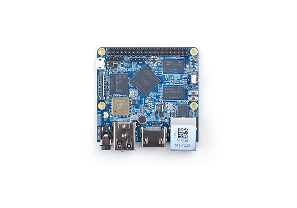
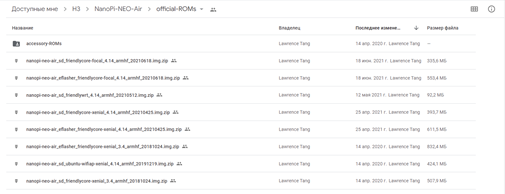

Первый запуск
=============

.. _installation:

Знакомство с платой
-------------------

Микрокомпьютер NanoPi представляет собой встраиваемый одноплатный микрокомпьютер с размещенными на одной плате вычислительным процессором, оперативной памятью, блоком энергонезависимой памяти, а также набором беспроводных интерфейсов, таких как: Bluetooth и Wi-Fi. Внешний вид микрокомпьютера представлен на рисунке 1.1: 

       Рисунок 1.1 – Внешний вид микрокомпьютера NanoPi

Микрокомпьютер NanoPi от AppliedRobotics имеет следующие характеристики описанные в таблице 1.1: 

.. table:: Таблица 1.1 – технические характеристики микрокомпьютера NanoPi:

    +------------------------+----------------------------------------+
    | Система на кристалле   | Allwinner H3 (CPU + GPU)               |
    +------------------------+----------------------------------------+
    | Процессор              | 4 ядера (Quad-core) ARM Cortex-A7      |
    |                        | 1.2 ГГц, 32KiB Instruction + 32KiB     |
    |                        | Data L1 cache на ядро и 512KB L2 cache |
    +------------------------+----------------------------------------+
    | Графический процессор  | Mali-400MP2 600 МГц                    | 
    |                        | поддерживает OpenGL ES 2.0             |
    |                        | OpenCL 1x, DX9_3, OpenVG,              |
    |                        | 1080p45 H.264                          |
    +------------------------+----------------------------------------+
    | ОЗУ                    | DDR3 256/512 Мб (совместно с GPU)      |
    +------------------------+----------------------------------------+
    | ПЗУ                    | microSD-Card до 128 ГБ                 |
    +------------------------+----------------------------------------+
    | Видео выход            | Композитный/Интерфейс CVBS (TV-OUT)    |
    +------------------------+----------------------------------------+
    | Аудио вход / выход     | Микрофон (выводы 8 и 9 из 12)          |
    |                        | Выводы 10 и 11 из 12 (двухканальный)   |
    +------------------------+----------------------------------------+
    | USB                    | USB OTG и USB 2.0 хост и два USB       | 
    |                        | 2.0 порта выводы 2, 3, 4 и 5           |
    +------------------------+----------------------------------------+
    | Прочее                 |ИК-порт (вывод 6 из 12)                 |
    +------------------------+----------------------------------------+
    | Питание                | 5 В 2 А                                |
    +------------------------+----------------------------------------+
    | Размер                 | 40 x 40 мм                             |
    +------------------------+----------------------------------------+
    | Вес                    | 14 г                                   |
    +------------------------+----------------------------------------+

Подбор дистрибутива и его настройка
-----------------------------------

В качестве дистрибутива должен использоваться официальный образ для микрокомпьютеров nanopi Neo Air доступный по следующей ссылке:
https://drive.google.com/drive/folders/1ws6rPIIQoS4khtabX0ohfg5JTQ0YywOv

       Рисунок 1.2 – Образы для скачивания
       
Отсюда нам необходим: “nanopi-neo-air_sd_friendlycore-xenial_3.4_armhf_20181024.img”

Для установки и настройки образа ОС необходимо:

1. SD-карта, на которую будет установлен образ ОС, с помощью программы BalenaEtcher и ожидать загрузки и проверки образа
#. Вставляем sd-карту в микрокомпьютер и устанавливаем на плату расширитель
#. подключаем расширительную плату к компьютеру с опеционнной системой на базе linux
#. Открываем терминал и прописываем команду: picocom -b 115200 /dev/ttyUSB0
#. После подключения вводится команда su root и вводится пароль fa
#. Вводится в консоль команда npi-config
#. После этого в меню выбирается пункт “Interfacing options”
#. В данном подменю включаем функцию SSH для удаленного управления через Wi-Fi
#. Необходимо выйти из меню и ввести в консоли nmcli r wifi on
#. После включения Wi-fi, сканируем сети с помощью команды nmcli dev wifi
#. С помощью команды nmcli dev connect “SSID” password “PASSWORD” ifname wlan0

После выполнения данных пунктов удалённое подключение к плате будет настроено

.. tip:: С помощью команды ifconfig можно узнать ip адрес платы. Для удаленного подключения к плате необходимо выполнить команду: ssh root@”Ip адрес платы”.
