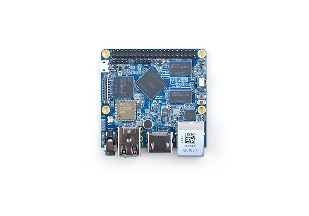

Первый запуск
=============

.. _installation:

Знакомство с платой
-------------------

Микрокомпьютер NanoPi представляет собой встраиваемый одноплатный микрокомпьютер с размещенными на одной плате вычислительным процессором, оперативной памятью, блоком энергонезависимой памяти, а также набором беспроводных интерфейсов, таких как: Bluetooth и Wi-Fi. Внешний вид микрокомпьютера представлен на рисунке 1.1: 

       Рисунок 1.1 – Внешний вид микрокомпьютера NanoPi

.. code-block:: console

   (.venv) $ pip install lumache

Creating recipes
----------------

To retrieve a list of random ingredients,
you can use the ``lumache.get_random_ingredients()`` function:

.. autofunction:: lumache.get_random_ingredients

The ``kind`` parameter should be either ``"meat"``, ``"fish"``,
or ``"veggies"``. Otherwise, :py:func:`lumache.get_random_ingredients`
will raise an exception.

.. autoexception:: lumache.InvalidKindError

For example:

>>> import lumache
>>> lumache.get_random_ingredients()
['shells', 'gorgonzola', 'parsley']
